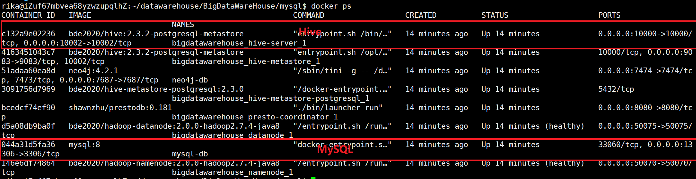

## 连接服务器

 - IP：[数据删除]
 - 用户名：[数据删除]
 - 密码：[数据删除]

`[数据删除]` 账户有 `sudo` 权限。

可以下载 `Xshell` 来进行 `ssh` 连接，或者直接在命令行中输入：

```sh
ssh [数据删除]@[数据删除]
```

并输入密码也可连入服务器。

连入服务器后，输入:

```sh
cd ~/datawarehouse/BigDataWareHouse/
```

可以进入本项目的基目录。

## 上传数据文件

`docker` 是一种容器软件（类似虚拟机），`Hive` 和 `MySQL` 并未安装在云服务器实机上，而是安装在 `docker` 内部。

在 `docker-compose.yml` 文件中设置了若干实机文件夹到 `docker` 内部文件夹的映射。

 - MySQL
   - 实机的 ./mysql/data 映射到 docker 内部的 /var/lib/mysql
   - 实机的 ./mysql/config 映射到 docker 内部的 /etc/mysql/conf.d

 - Hive
   - 实机的 ./hive/data 映射到 hadoop datanode (注意：不是 Hive) docker 内部的 /hadoop-data

可以使用 **WinSCP** 来将数据文件从本地上传到云服务器实机上的对应文件夹。

## 进入 docker

输入下列命令，列出所有 `docker` 进程：

```sh
docker ps
```

如下图所示：



要进入哪个 `docker` 的命令行，就输入：

```sh
docker exec -it [container-id] /bin/bash
```

`container-id` 不必输全，只要能区分容器即可。例如，要进入 `Hive` 的 `docker` 只需输入 `c132` 作为 `container-id`。

要退出 `docker` 回到原先的命令行，请输入：

```sh
exit
```

